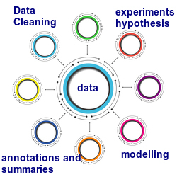

```{r setup, include=FALSE}
knitr::opts_chunk$set(echo = TRUE)
```
## Intended Users
* Users who need to develop models on a batch of data and then subsequently repeat this task.
* Users who need to develop analytic dashboards on a batch of data and then subsequently repeat this task
* Users who need to perform adhoc searches on data used for modelling and data produced by modelling

By implication, continous time use cases - online models are excluded.


## Core Principles
* If modeling or dash board development is done at a point in time, then the **time** at which this activity was performed is a key property. Another way of saying this is that time is an **impicit** attribute in all candidate use cases.
* Sometimes large data assets are small data assets aggregated over time.
* Data, its properties and constraints affect modelling choices
* Experimentation is **required** to understand data properties and constraints. 
* Since data can change over time, properties and constraints can change over time. This implies that constraints and properties of the data have an implicit time period associated with them.
* Modelling decisions and justification, experimental observations, discovered insights and verified hypothesis have an implicit time period associated with them.
<center>
    
    
    <a href="http://www.freepik.com">Designed by Zirconicusso / Freepik</a>
</center>

* The decision to put a model into service (a deployment) defines a time period or temporal label
* This temporal label is assoicated with an atomic data container that encapsulates the data, the modelling activity, the cleaning activity and all annotations such as dependencies, summaries and observations made. 
* The scientific community has identified the need to nail all activities associated with a particular model into a self-describing atomic unit.


* The data science community has created several mature, robust and reliable tools for performing individual tasks performed as part of model development.
* Using components that have proven reliablity and have endured the test of time can help build products taht are reliable. Ofcourse it goes without saying that the aggregation of such products must also be robust and reliable for the aggregated product to be reliable.
* Data science teams work on public or private clouds.


## Define Initial Iteration
### Dataset Research

### Identify Candidate Datasets

### Framework Research

### Identify Computational Framework

### Identify Data Representation Standards and Formats


